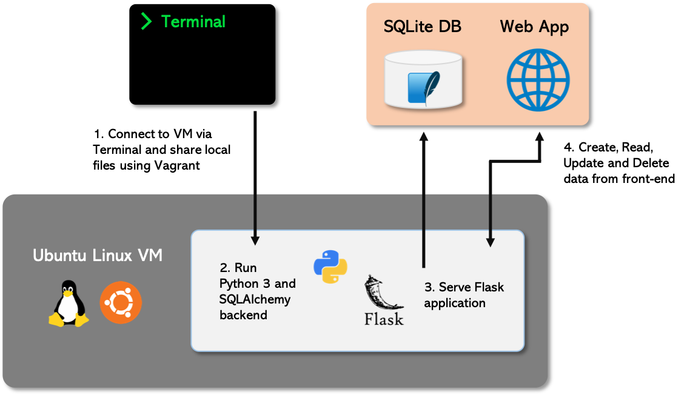
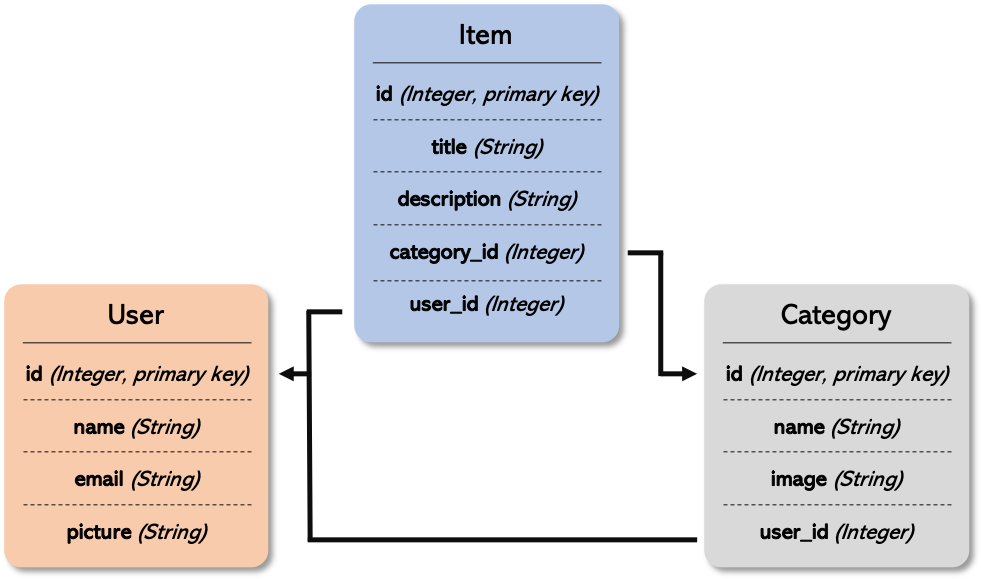

# Item Catalog

This item catalog project is a web application designed for a store with the ability to:

1. **Create**,
2. **Read**,
3. **Update**,
4. And **delete**...

items and item categories within a catalog. Security features have been implemented to protect resources from being edited or removed by un-authorised users.

***

## Solution Architecture

The architecture for this web application consists of a Flask application accessing data from a SQLite database, being served from a Linux Virtual Machine (VM). The front end has been built HTML, CSS, JavaScript, jQuery and AJAX. The backend was built using Python and SQLAlchemy. See the below architecture diagram for an overview of the application.

 
 

    

 
 

The backend is made of 3 tables:

1. **Item**: for the items within the catalog
2. **Category**: for the categories within the catalog
3. **Users**: for the users that have ownership of categories and items

See the below diagram for a detailed understanding of the data model.

 
 

    

 
 

The application is built from the below files:

- **application.py**: This script is the application contains the backend logic of the application, routing for each page and JSON endpoints.
- **database.py**: This module consists of 3 classes, representing the 3 tables within the database. The relationships within the data model are reflected within this file.
- **populatedb.py**: This script can be run to populate the empty database after cloning the repository. 
- **client_secrets.json**: Contains client ID and client secrets for Google Sign-In authentication.

**/templates**

- **main**: Contains prerequisities for Google Sign-In, jQuery, fonts, styling and Bootstrap as well as JavaScript and AJAX queries to handle Google Sign-In/Out.
- **header**: Contains navbar and flash messages.
- **loginPage**: Landing page for the web application.
- **welcome**: Welcome page after signing in.
- **allCategories**: Responsive card based page to display all catalog categories.
- **newCategory**: Add a new category after signing in to the catalog.
- **editCategory**: Edit an existing category, if authorised, after signing in.
- **deleteCategory**: Delete an existing category, if authorised, after signing in.
- **showItems**: Show all items within a category.
- **newItem**: Add a new item to a category, if authorised, after signing in.
- **editItem**: Edit an existing item, if authorised, after signing in.
- **deleteItem**: Delete an existing category, if authorised, after signing in.
- **unAuthorisedEntry**: Fallback unauthorised entry page if an unauthorised user tries to create, update or delete data.

**/static**

- **css/styles.css**: Contains all styling properties of the web application.
- **/images**: Contains all images for the catalog categories.

***

## Code Design

### Bootstrap
The styling for this web application utilises the Bootstrap framework https://getbootstrap.com. Bootstrap is an open source toolkit for developing with HTML, CSS, and JavaScript.

### Security
Protecting data from unwanted users is paramount. The resources available within this application are protected without authorisation. This web application implements an OAuth token based security mechanism via Google Sign-In. Once a user has signed in, they are able to create new items and categories within the catalog. Authenticated users may only edit or delete items or categories that they have created.

To improve user experience, access to edit and delete is only capable within categories and items assigned to the user that created them.

### API Endpoints
This web application includes 3 API endpoints, accessible in a JSON format via REST. Details of the 3 APIs are below:

- **Catalog API**: Returns data on all categories and items within categories in a JSON format.
- **Category API**: Returns data on items within a specific category based on `category_id`.
- **Item API**: Returns data on a specific item within a category based on `category_id` and `item_id`.

***

## Installation

### Installing the VM software
To run this web application application, you need to install and configure a Linux VM on top of your operating system. For this, you will need to install two pieces of software:
- **VirtualBox**: https://www.virtualbox.org/wiki/Downloads
    - This is the software that actually runs the VM. Install the *platform package* for your operating system, you do not need the extension pack or the SDK. You do not need to launch VirtualBox after installing it, we can do this via Vagrant. 
- **Vagrant**: https://www.vagrantup.com/downloads.html
    - Vagrant is the software that configures the VM and lets you share files between your host computer and the VM's filesystem.

You will also need a Unix-style terminal program. On Mac or Linux systems you can use the built-in Terminal. On Windows, Git Bash is recommended. 

### Starting the VM Image
Once you have VirtualBox and Vagrant installed, open a terminal and run the following commands:

    $ mkdir item_catalog
    $ cd item_catalog

This will create a new directory for this project. Then, download this ZIP file:
- https://s3.amazonaws.com/video.udacity-data.com/topher/2018/April/5acfbfa3_fsnd-virtual-machine/fsnd-virtual-machine.zip

This will download the Linux image `FSND-Virtual-Machine` into your downloads folder. Once it's finished downloading, open the folder `FSND-Virtual-Machine` and move everything within the `vagrant` folder into your `item_catalog` folder. The Linux instance is now within the `item_catalog` directory. Now we want to start the image. Navigate to your `item_catalog` folder and issue the following commands:

    $ cd vagrant
    $ vagrant up

Next, to log into the Linux instance, run:

    $ vagrant ssh

Congratulations! You've now installed the Linux image, started the VM and are logged into the VM via ssh. If you log out of the Linux instance or close the terminal, the next time you want to use it you only need to run `cd logs_analysis` and `vagrant ssh`.

### Configuring the Virtual Machine
To install the correct packages, make sure you're still working within the installed VM. If not, `cd item_catalog` and run `vagrant ssh`.
#### Python
For this project, we will be using Python 3. Check the version of Python installed within the VM by running:

    $ python --version

If the VM is using Python 2 (returning something that looks like this: "Python 2.x.x"), then you must upgrade this to Python 3 ("Python 3.x.x"). If you already have Python 3 installed, then skip to the next part on installing Psycopg2. To upgrade Python 2 to Python 3, use the following commands:

Download the package lists from the repositories and update them.

    $ sudo apt-get update

Install Python 3

    $ sudo apt-get install python3

Change the default Python version

    $ sudo rm /usr/bin/python
    $ sudo ln -s /usr/bin/python3 /usr/bin/python

Check that Python 3 is installed and active. The output of this command should be something like "Python 3.5.2".

    $ python --version

#### Dependencies

To install the dependencies for this web application, please run the following command:

    $ sudo pip install -r requirements.txt

This will install the following packages:

- **SQLAlchemy**: the Python SQL toolkit and Object Relational Mapper that gives application developers the full power and flexibility of SQL https://www.sqlalchemy.org.
- **Flask**: is a microframework for Python based on Werkzeug, Jinja 2 and good intentions. You can use Flask to serve applications simply and easily http://flask.pocoo.org.
- **Google API Python Client**: obtains end-user authorization grants for use with other Google APIs.

### Set up application
Now you will clone this repository into the vagrant folder so that you can set up and run the application from the Linux VM on your local machine. To do this, open up a fresh terminal window (outside of the VM) and issue the following commands:

    $ cd item_catalog/vagrant 
    $ git clone https://github.com/agodwinp/udacity-item-catalog

Within the vagrant folder, you should now see a `udacity-item-catalog` folder containing the files within this repository. In order to populate the database with data, switch over to the terminal that you issued `vagrant ssh` from, where you should now be logged into the VM. Then run the following commands:

    $ cd /vagrant
    $ cd udacity-item-catalog
    $ python populatedb.py

If this runs successfully, then the database is now populated and the application is ready to run.

***

## Usage

Now you are ready to run the application! You must ssh into the VM, then access the shared files folder and finally run the application. To do this, run the following commands:

    $ cd item_catalog/vagrant
    $ vagrant ssh
    $ cd /vagrant
    $ cd udacity-item-catalog
    $ python application.py

When you run the final command, you should now see that within the Vagrant VM the application is being served on "http://0.0.0.0:8000". To access the web application, open up a new web browser window on the same machine and go to this URL address: "http://0.0.0.0:8000" or "http://localhost:8000". 

If this connects successfully, you will see a GET request within the Vagrant VM output and the landing page for the web application within the web browser, prompting the user to `Enter` the site or `Login`.

***Well done!*** You ran a data driven web application running on a Linux VM! Let me know what you think!

***

## Authors

- **Arun Godwin Patel** - Machine Learning Developer & Data Scientist

